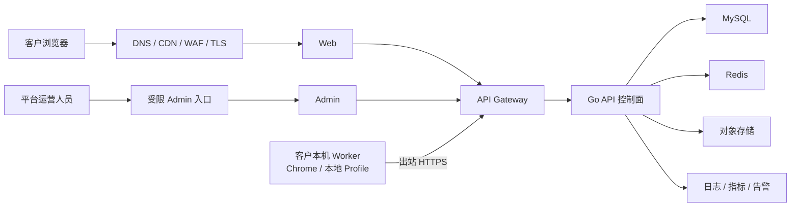

# Browser Agent 线上客户交付与生产化技术方案

## Changelog

- 2026-07-19：落地 Phase 2 第一批生产基线：统一生产 Compose 入口、完整 commit SHA 镜像发布、文件 Secret、MySQL migration job、MySQL/Redis TLS、健康检查、资源限制和手动部署/回滚；实际云资源、对象存储、备份恢复和 staging E2E 尚待完成。
- 2026-07-19：完成 Phase 1 客户身份主链路：`users` schema/migration、邮箱密码注册登录、租户 owner 创建、JWT + HttpOnly Cookie、active membership 在线校验、登录路径限流、登录/Worker 配对 Web UI 和本地 Gateway 端到端验收。
- 2026-07-19：同步 Phase 1 首批实现：新增租户 schema/migration、Automation/Worker resource ownership、可信 Gateway 身份头、严格配对批准与双租户越权测试；真实账号登录和 membership 校验尚未完成。
- 2026-07-19：首次建立线上客户交付与生产化技术基线，确定“云端控制面 + 客户本机 Worker”的首期形态，并拆分账号租户、部署、数据安全、Worker 交付、可观测性和发布门禁。

## 1. 文档信息

- **状态**：执行基线
- **适用范围**：Browser Agent `main` 主线
- **目标阶段**：受邀客户封闭内测，随后再评估开放注册和正式商用
- **关联文档**：
  - `docs/brd/0627-browser-agent-automation-brd.md`
  - `docs/tech/0709-browser-agent-branch-handoff.md`
  - `docs/tech/0617-local-automation-worker-architecture.md`
  - `compliance/0619-browser-automation-crawler-compliance-note.md`

## 2. 背景与目标

当前项目已经完成 Windows 本地环境下的 Web → API → Worker → Admin 确定性链路验证，能够创建任务、控制本机浏览器、回传 trace 和 artifact。现有部署、鉴权和数据边界仍以本地开发或单一受信环境为前提，不能仅通过暴露端口或绑定域名直接面向多个客户。

本方案的目标是把现有本地可运行底座推进到可供受邀客户使用的线上版本，并满足以下条件：

1. 客户只能访问本租户的设备、任务、run、trace 和 artifact。
2. 第三方平台登录态和浏览器 profile 默认保留在客户本机。
3. 云端服务具备固定域名、TLS、持久化存储、备份、监控和可回滚发布能力。
4. Worker 可安装、配对、升级、撤销，并通过出站 HTTPS 与云端通信。
5. 高风险浏览器动作具有域名、动作、频率、人工确认和审计约束。
6. 线上发布经过自动化测试、安全检查和验收门禁。

首期不包含以下目标：

- 不建设公共云多租户 Browser Worker 集群。
- 不在云端托管第三方网站 Cookie、Session 或账号密码明文。
- 不以首期封闭内测为由同时建设完整计费、渠道和大规模 Kubernetes 平台。
- 不承诺自动化结果构成版权或其他法律结论。

## 3. 关键架构决策

### 3.1 首期采用云端控制面 + 客户本机 Worker

首期推荐形态：



选择该形态的原因：

- 当前 Worker 已围绕本机 Chromium、持久浏览器 profile 和本地文件设计。
- 客户的社媒登录态、微信资料和本机文件不需要上传到云端。
- Worker 只需主动访问云端，不要求客户网络开放入站端口。
- 可先生产化控制面和交付链路，避免同时承担云端浏览器隔离、代理 IP、验证码和会话托管风险。

### 3.2 完全云端 Worker 延后评估

只有满足以下条件后，才进入完全云端 Worker 方案设计：

1. 明确必须在客户设备离线时继续运行的商业场景。
2. 建立租户隔离的浏览器 sandbox、profile 加密和生命周期管理。
3. 建立并发调度、CPU/内存配额、任务超时和恶意任务隔离。
4. 明确第三方平台登录态托管、代理网络、数据地域和平台条款边界。
5. 完成安全评审、成本模型和故障恢复演练。

## 4. 当前基线与主要缺口

| 领域 | 当前基线 | 线上缺口 |
| --- | --- | --- |
| 身份与权限 | 已有 user/tenant/membership、邮箱密码登录、JWT/HttpOnly Cookie、active membership 校验、最小角色集和完整 resource ownership | 缺成员邀请/移除、密码找回、邮箱验证、MFA/SSO 和 platform admin 独立身份流程 |
| Worker 身份 | 严格模式下配对必须由 tenant owner/platform admin 批准；登录后 Web 配对 UI、device token、心跳、租户一致性和 revoke 已接通 | 缺客户化安装、安全凭据存储和升级 |
| API 入口 | Gateway 已代理 `/api/v1/auth/*`、`/web/*`、`/admin/*`、`/worker/*`，校验 Cookie/JWT、清除外部身份头并注入租户 actor；登录注册有独立 IP 限流 | 缺生产域名、TLS/WAF、安全响应头完善和 staging 部署验收 |
| 部署 | 有本地 Compose、生产 Compose 草案和 K3s 骨架 | 默认凭据、端口暴露、健康检查、变量、镜像版本和服务清单未形成可验收发布物 |
| Artifact | API 支持上传、记录和下载，本地有请求大小上限 | 主要依赖本地文件路径，缺对象存储、租户级授权、留存、删除、扫描和容量配额 |
| 数据 | MySQL schema 和 migration 已存在，Redis 用于 claim lock | 缺自动 migration job、托管备份、恢复演练、连接和容量告警 |
| 安全策略 | Worker 有 `allowed_domains`、`allowed_actions`、timeout 等 policy gate | 部分 Web 入口仍使用通配域名；缺内网地址阻断、租户限流和统一高风险动作确认 |
| 可观测性 | 有健康检查、Worker 心跳、run 状态和日志 | 缺集中日志、核心指标、告警、前端错误采集和线上 trace 关联 |
| CI/CD | Go 与前端已有基础构建测试 | Worker 未纳入完整 CI，缺镜像构建/扫描/推送、staging、部署、回滚和线上 E2E |

数据库中的部分 `user_id` 字段仍为兼容旧数据的可空字段；`tenant_id` 已通过基线和幂等 migration 加入 Worker/Automation 资源，并在 handler、repository、Worker 领任务/回写和 artifact 下载链路强制 ownership。真实账号会话已接入同一 ownership 链路；封闭内测前仍需补成员生命周期、密码找回/邮箱验证和独立 platform admin 身份。

## 5. 详细技术设计

### 5.1 身份、租户与 RBAC

#### 5.1.1 核心实体

至少增加或接入以下实体：

- `tenant`：客户组织或独立客户的资源边界。
- `user`：登录主体。
- `tenant_membership`：用户在租户内的角色与状态。
- `worker_device`：增加非空 `tenant_id`，并记录配对人、撤销人和最后版本。
- `automation_job`、`automation_run`、`automation_artifact`、`automation_manual_action`：增加或强制 `tenant_id` 和创建者/操作人字段。

首期租户角色建议保持最小集合：

| 角色 | 权限 |
| --- | --- |
| `tenant_owner` | 管理成员、设备、策略和全部租户资源 |
| `tenant_member` | 创建任务并查看被授权的租户资源 |
| `tenant_viewer` | 只读查看任务、run 和报告 |
| `platform_admin` | 平台运维角色；与租户角色分离，不通过客户 Web 登录面授予 |

#### 5.1.2 请求身份链路

1. Gateway 校验会话或 JWT，得到 `user_id`、`tenant_id` 和 role。
2. Gateway 清除外部请求伪造的内部身份头，再向 API 注入可信身份上下文。
3. Gateway 到 API 使用内部网络和服务间 secret 或签名，API 不直接信任公网身份头。
4. API handler 解析 actor，engine 执行权限决策，repository 的读取和写入查询必须包含 `tenant_id`。
5. 任何通过 `job_id`、`run_id`、`artifact_id`、`device_id` 访问资源的接口都必须验证 ownership。

共享的 `ADMIN_API_TOKEN` 和 `WEB_API_TOKEN` 只能保留为本地开发或受控诊断能力，不能作为客户账号体系。

当前账号接口：

| 方法与路径 | 作用 | 匿名访问 |
| --- | --- | --- |
| `POST /api/v1/auth/register` | 创建 user、tenant 和 `tenant_owner` membership，并签发会话 | 仅当 `ALLOW_PUBLIC_REGISTRATION=true` |
| `POST /api/v1/auth/login` | 校验 bcrypt 密码和 active membership，签发短期会话 | 是 |
| `GET /api/v1/auth/me` | 从 Bearer 或 HttpOnly Cookie 读取并实时校验 session | 否 |
| `POST /api/v1/auth/logout` | 清除浏览器 access cookie | 是 |

访问 token 固定校验 HS256、issuer、audience、`exp` 和 `nbf`；`JWT_SECRET` 不足 32 字符时服务拒绝启用账号鉴权。浏览器默认使用 `SameSite=Lax`、`HttpOnly` Cookie，生产必须开启 `Secure`。Gateway 只对注册、登录、登出做精确匿名路径匹配，`/api/v1/auth/me` 不得因前缀匹配绕过鉴权。API 在使用 token 后再次读取 active user/tenant/membership，避免仅依赖签发时的角色快照。

#### 5.1.3 Worker 配对

生产配对流程应为：

1. 已登录客户在 Web 创建一次性配对码。
2. 配对记录绑定 `tenant_id`、发起用户、过期时间和允许的设备能力。
3. Worker 提交配对码和本机公钥/设备指纹，API 返回短期 bootstrap credential。
4. Worker 换取可撤销的 device token，服务端只保存 token hash。
5. 后续心跳、领任务、上传 artifact 和完成 run 都校验 device 与租户、run 的一致性。
6. 设备撤销后立即拒绝新请求，并保留操作审计。

### 5.2 API、域名与网络边界

生产域名至少区分：

- `app.<domain>`：客户 Web。
- `api.<domain>`：Gateway/API 入口；也可由 Web 同源反向代理。
- `admin.<domain>`：平台 Admin，必须独立鉴权，并优先增加访问策略、VPN 或身份代理。

网络规则：

- 公网只开放 443，数据库、Redis 和 API 容器端口不直接暴露。
- Worker 通过 HTTPS 长轮询或轮询访问 `/worker/*`，不需要客户开放入站端口。
- CORS 使用精确域名列表，禁止本地默认 CORS 规则直接用于生产。
- Gateway 统一处理 request ID、鉴权、限流、请求体上限和安全响应头。
- API 为任务创建、取消、配对和上传操作提供幂等键与明确超时。
- Artifact 下载不暴露本地路径；API 完成 ownership 校验后返回短时签名 URL 或受控流式响应。

### 5.3 任务安全与资源控制

生产默认 policy 必须满足：

- 客户不能提交 `allowed_domains: ["*"]`；域名来源于受控模板或显式白名单。
- URL 解析和跳转后都要重新校验域名，并拒绝 loopback、内网地址、链路本地地址和云元数据地址。
- `allowed_actions` 使用最小权限；发布、删除、付款、授权、外部上传等动作默认进入 `manual_action`。
- 按用户、租户、设备和目标域名设置任务频率与并发上限。
- 按任务类型设置最长运行时间、最大步骤数、最大下载/上传量和 LLM Token 预算。
- 任务取消、Worker 离线和超时后可释放 claim，并保证 completion 幂等。
- prompt、页面观察、trace、截图和日志执行敏感信息最小化或脱敏。

### 5.4 数据、Artifact 与 Secret

#### 5.4.1 数据组件

首期推荐使用：

- 托管 MySQL：业务真相源，启用自动备份和时间点恢复能力。
- 托管 Redis：claim lock、限流和短期状态，不作为不可恢复的业务真相源。
- S3/R2 兼容对象存储：保存截图、trace、报告、manifest 和客户允许上传的文件。

Artifact object key 必须包含不可猜测的租户和 run 隔离前缀，例如：

```text
tenants/{tenant_id}/runs/{run_id}/{artifact_id}/{sanitized_filename}
```

数据库只保存对象 key、大小、哈希、MIME、创建人、保留策略和扫描状态，不保存公共永久 URL。

#### 5.4.2 生命周期

- 每种 artifact 类型定义默认保留期。
- 删除租户或任务时进入可审计的异步删除流程。
- 下载前验证租户 ownership、角色和 artifact 状态。
- 对客户上传文件执行 MIME/扩展名校验、大小限制和敏感文件/恶意内容扫描。
- 备份必须定期执行恢复演练，不能只验证“备份任务成功”。

#### 5.4.3 Secret

- JWT、内部服务密钥、数据库密码、对象存储凭据和第三方服务密钥进入 Secret Manager。
- Worker device token 使用 Windows Credential Manager、macOS Keychain 或等价安全存储。
- 不启用生产环境的 insecure file secret 开关。
- LLM Key 明确采用平台托管或客户 BYOK 模式；两种模式都不得进入前端 localStorage、日志或 artifact。
- 建立 secret 轮换和泄露后的吊销流程。

### 5.5 Worker 客户端交付

首期优先支持 Windows，交付要求如下：

1. 提供签名安装包、卸载程序和最小权限安装说明。
2. 支持初始化、配对、开机启动、暂停、恢复和日志导出。
3. 展示云端地址、设备名称、在线状态、版本和最后任务状态。
4. Worker 与 API 协议携带 `worker_version`、`protocol_version` 和 capability 版本。
5. 服务端可设置最低兼容版本，旧版本获得明确升级提示，不直接领取不兼容任务。
6. 自动升级包必须校验签名和哈希，并支持回滚到上一个稳定版本。
7. 浏览器 profile、第三方 Cookie 和 Session 留在客户本机；Worker 不将其作为 artifact 上传。
8. Worker extension/adapter 按客户套餐或授权启用，逐步避免所有能力默认进入同一个安装包。

### 5.6 部署与环境

#### 5.6.1 封闭内测推荐拓扑

首期不以 Kubernetes 为前置条件。推荐单区域部署：

- Web、Admin、Gateway、API 使用不可变容器镜像。
- 托管 MySQL、托管 Redis、对象存储独立于应用主机。
- DNS/CDN/WAF/TLS 位于应用入口前。
- Admin 使用独立访问策略。
- staging 与 production 使用不同数据库、对象存储 bucket、secret 和域名。
- migration 作为发布前独立 job 执行，失败时不得继续发布。

现有 `deploy-local/docker-compose.prod.yml` 只能作为草案，不得保留默认密码、公开数据库端口、Quick Tunnel 或 insecure Worker secret 后直接上线。现有 `deploy/k3s/` 也必须先完成以下校正并通过 staging 验收：

- API/Gateway 实际环境变量映射。
- `/health` 与 `/healthz` 健康检查路径。
- Admin 容器端口。
- Gateway 对当前 Web、Admin、Worker API 的完整路由。
- MySQL/Redis 外部依赖或集群内资源的明确声明。
- Artifact 持久化或对象存储接入。
- 固定镜像 tag/digest、image pull secret、资源 requests/limits 和发布回滚。

#### 5.6.2 发布策略

- 镜像 tag 使用 commit SHA 或不可变版本，禁止生产使用 `latest`。
- 部署前执行 schema 兼容性检查和 migration dry-run/验证。
- 先部署 staging 并执行线上形态 E2E，再进入 production。
- API 先保持向后兼容，确保旧 Worker 在升级窗口内仍能完成或安全停止任务。
- 发布失败可回滚应用镜像；数据库变更优先采用 expand → migrate → contract，避免依赖破坏性回滚。

### 5.7 可观测性与告警

日志必须至少包含 `request_id`、`tenant_id`、`user_id`、`device_id`、`job_id` 和 `run_id`，并对 token、Cookie、Authorization、页面敏感内容和本地路径脱敏。

核心指标：

- API 请求量、P95/P99 延迟、4xx/5xx、数据库连接池。
- Worker 在线数量、离线时长、版本分布和心跳失败。
- 任务队列深度、等待时间、run 时长、成功率、失败码和重试次数。
- Artifact 上传失败、扫描失败、存储容量和下载错误。
- LLM 调用次数、延迟、错误率和 Token/成本。
- 平台登录失效、验证码、manual action 积压和发布失败。

首期必须设置：

- API 大面积 5xx 告警。
- Worker 批量离线告警。
- 任务长时间排队或运行超时告警。
- 数据库/Redis/对象存储不可用告警。
- Artifact 上传失败率和社媒发布失败率告警。

### 5.8 CI/CD 与质量门禁

合并 `main` 前：

- Go：`go vet`、`go test`、build。
- Web/Admin：typecheck、lint、build。
- Worker：Python 3.12 单测、policy/adapter fixture 测试和打包验证。
- 数据库：初始化基线与历史 migrations 最终 schema 一致性检查。
- 安全：依赖漏洞、secret、镜像和许可证扫描。

发布前：

- 构建并推送带 commit SHA 的镜像和 Worker 安装包。
- 部署 staging，执行 Web → API → Worker → artifact → Admin E2E。
- 验证租户 A 无法读取、下载、取消租户 B 的任何资源。
- 验证设备撤销、Worker 离线、任务超时、对象存储失败和数据库恢复流程。
- 生产发布后执行只读 smoke test，并保留回滚入口。

## 6. 分阶段实施计划

### Phase 0：文档和决策基线

- [x] 确定首期采用云端控制面 + 客户本机 Worker。
- [x] 记录现有部署、安全和运维缺口。
- [ ] 确定域名、云环境、身份方案、对象存储和封闭内测客户范围。

### Phase 1：身份与租户隔离（上线阻断）

- [x] 实现用户、租户、membership 和 RBAC 主链路（注册自动创建 owner；active membership 在会话与 `/web/*` 两层校验）。
- [x] 为设备及 `automation_*` 资源增加强制 ownership。
- [x] 列表、详情、下载、取消、人工动作、Worker 回写和设备操作已增加双租户授权测试。
- [x] Worker 配对绑定登录用户和租户，提供登录后 Web 批准 UI，并支持立即 revoke。
- [x] 将客户接口接入 Gateway 的真实 JWT/HttpOnly Cookie 鉴权链路，并完成本地端到端验收。

**验收门禁**：使用两个测试租户执行自动化越权测试，任何跨租户读取、写入、下载或设备操作均返回拒绝。

### Phase 2：生产基础设施与数据（上线阻断）

- [ ] 建立 staging/production 环境和固定域名/TLS。
- [ ] 接入托管 MySQL、Redis、对象存储和 Secret Manager。
- [ ] 建立 migration job、自动备份和恢复演练。
- [x] 修复并统一当前应用配置，选择 `deploy/production/compose.yaml` 作为唯一受支持的生产入口；K3s 保留为实验草案。
- [x] 完成 API/Gateway/Web 的不可变 GHCR 镜像构建/推送，以及基于完整 commit SHA 的部署和手动回滚入口。

**验收门禁**：staging 重建后无需手工修改容器即可启动；升级、回滚、备份恢复和 artifact 下载均通过验收。

### Phase 3：Worker 客户端交付（内测阻断）

- [ ] 生成签名 Windows 安装包。
- [ ] 接入系统凭据库、开机启动、日志导出和状态检查。
- [ ] 增加版本/协议兼容与受控自动升级。
- [ ] 完成全新客户电脑的安装、配对、任务、升级和卸载验收。

**验收门禁**：客户无需安装 Python、Node、Go 或操作仓库即可完成 Worker 使用。

### Phase 4：安全、可观测性与稳定性（内测阻断）

- [ ] 移除通配 `allowed_domains`，增加内网/危险地址阻断。
- [ ] 增加租户配额、限流、幂等、超时和高风险动作确认。
- [ ] 接入集中日志、指标、前端错误和核心告警。
- [ ] 完成 Worker 离线、平台登录失效、存储失败和队列堆积演练。

**验收门禁**：关键故障能够在约定时间内被发现、定位，并通过暂停任务、撤销设备或回滚版本止损。

### Phase 5：封闭内测与商用准备

- [ ] 邀请少量明确授权的客户，默认不开启公开注册。
- [ ] 完成版权检索首个真实业务闭环和人工复核报告。
- [ ] 为社媒发布明确平台级人工确认默认值和审计字段。
- [ ] 建立隐私政策、客户授权、数据留存/删除、导出和注销流程。
- [ ] 根据真实任务数据评估套餐、配额、成本和支持流程。

**验收门禁**：封闭内测期间无跨租户数据事件，核心任务成功率、人工接管率和单位任务成本达到产品定义目标后，再评估开放注册。

## 7. 上线检查清单

### 身份与安全

- [ ] 生产环境不存在默认密码、空鉴权 token 或 insecure file secret。
- [ ] 客户和 Admin 使用独立身份与权限模型。
- [x] Worker/Automation 核心资源接口已有双租户 ownership 测试。
- [ ] Worker 配对码一次性、短时有效并绑定租户。
- [ ] Secret 可轮换，日志和 artifact 不包含凭据明文。

### 数据与可靠性

- [ ] MySQL、Redis 和对象存储不直接暴露公网。
- [ ] Artifact 使用对象存储和短时授权下载。
- [ ] migration、备份、恢复和删除流程完成演练。
- [ ] 服务具有 readiness/liveness、资源限制和异常重启策略。
- [ ] 发布可使用不可变版本回滚。

### 产品与运维

- [ ] 客户能独立安装、配对、查看状态和提交日志。
- [ ] 平台能发现 Worker 离线、任务积压、run 超时和登录异常。
- [ ] 高风险动作需要人工确认并有审计记录。
- [ ] 客户授权、隐私、数据留存、删除和合规说明可查阅。
- [ ] 线上支持、故障响应和紧急停止任务流程明确。

## 8. 回滚与应急边界

- 提供全局和租户级任务暂停开关，事故期间停止新任务领取。
- 支持立即 revoke 单个设备或租户全部设备 token。
- 对象存储下载默认私有，可在异常时关闭签名 URL 生成。
- Gateway 可按路径、租户和 IP 临时限流或阻断。
- 应用回滚不依赖破坏性数据库回滚；schema 采用向前兼容迁移。
- 对疑似凭据泄露执行 secret 轮换、会话失效、审计检索和客户通知流程。

## 9. 待确认决策

在进入代码实施前，需要由项目负责人确定：

1. 首期部署云和数据地域。
2. 登录采用自建账号、OIDC 还是第三方身份服务。
3. 首期客户是个人租户还是企业组织，是否需要多人协作。
4. LLM 采用平台统一 Key、客户 BYOK，还是两者并存。
5. Artifact 默认保留期、单租户容量和最大文件大小。
6. 哪些社媒平台允许自动发布，哪些必须始终人工确认。
7. 封闭内测客户数量、支持渠道和故障响应目标。

在上述决策未完成前，可以先实施不依赖供应商的账号/租户/resource ownership 模型和授权测试，但不应把当前 Admin/API 直接暴露到公网。
